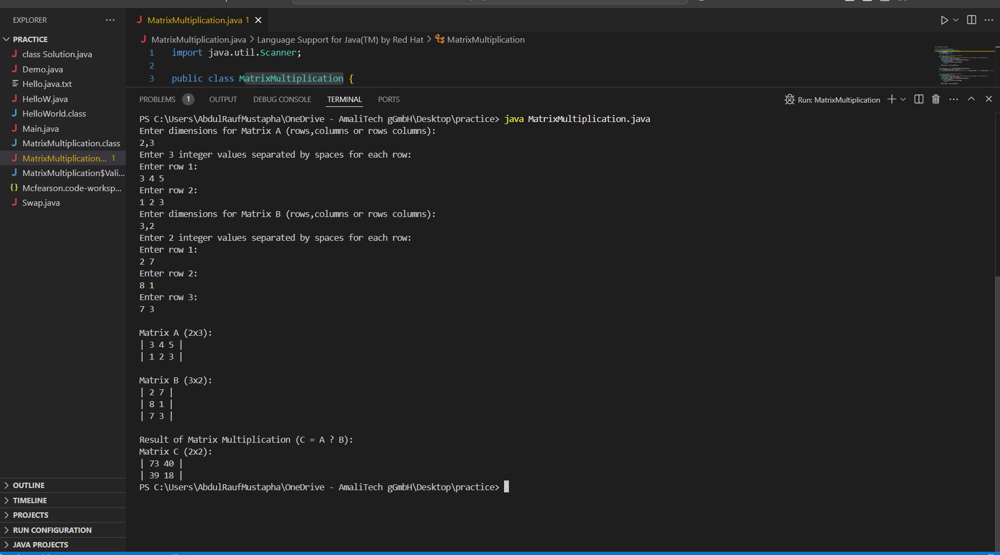

# This a code to multiply two matrices
# Matrix Multiplication Program

This Java program performs matrix multiplication by accepting user input for two matrices (A and B) and calculating their product (Matrix C). The program features robust input validation that supports both comma-separated (e.g., "2,3") and space-separated (e.g., "2 3") formats for matrix dimensions, while ensuring all inputs are valid integers. It handles various error cases gracefully, providing clear, user-friendly error messages when invalid inputs are detected, such as decimal numbers, non-numeric values, or incompatible matrix dimensions.

The program guides users through the input process with clear prompts, allowing row-by-row entry of matrix values with space-separated integers. After successful input validation, it displays both input matrices (A and B) along with their dimensions, followed by the resulting matrix C in a neatly formatted output with proper alignment and borders. For example, a 2x3 matrix multiplied by a 3x2 matrix will be displayed showing all three matrices with their dimensions, making it easy to verify both the input and the multiplication result. The program is ideal for educational purposes or quick matrix multiplication calculations, requiring only a basic Java runtime environment to execute.

##

### Screenshot of sample inputs and its corresponding output